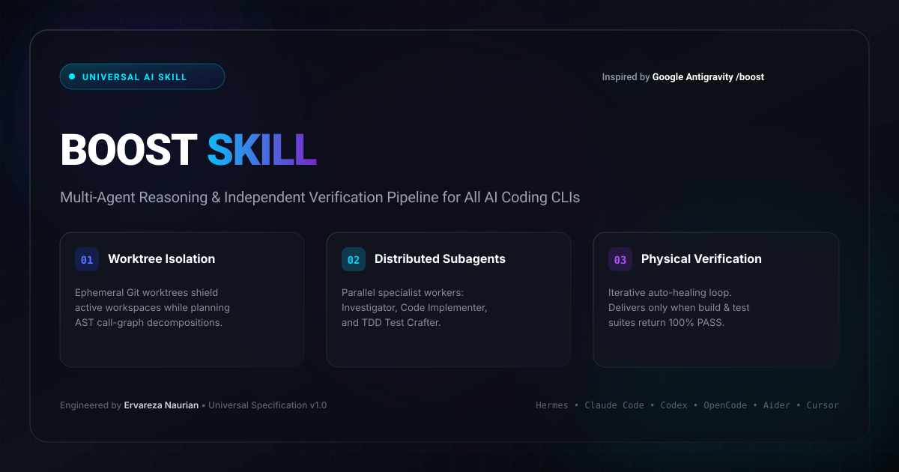
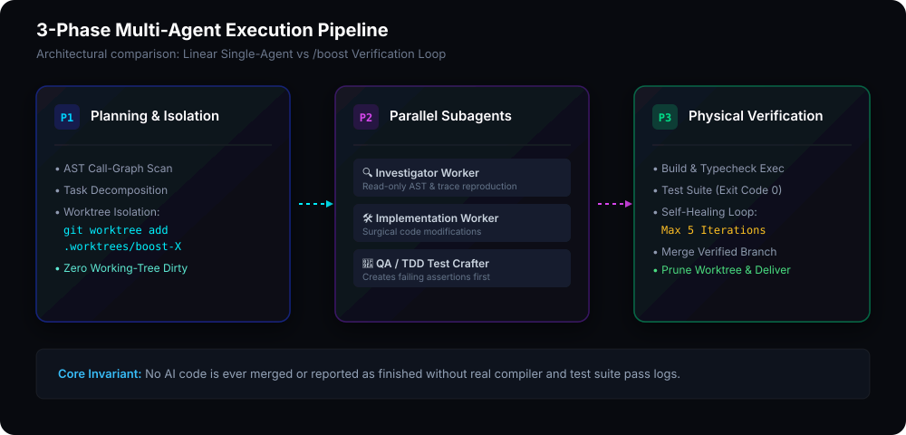

<p align="center">
  
</p>

<h1 align="center">⚡ Shiro X Dev/boost (Universal <code>/boost</code> Protocol)</h1>

<p align="center">
  <strong>Shiro X Dev Multi-Agent Reasoning & Independent Physical Verification Pipeline for All AI Coding CLIs</strong>
</p>

<p align="center">
  <a href="https://github.com/ervareza/boost-skill/blob/main/LICENSE"></a>
  <a href="https://github.com/ervareza/boost-skill"></a>
  <a href="https://github.com/ervareza"></a>
  
</p>

---

## ⚡ 1-Line Quick Install

Install **Boost Skill** across all detected AI agent environments on your machine in one command:

```bash
curl -fsSL https://raw.githubusercontent.com/ervareza/boost-skill/main/install.sh | bash
```

*Or install globally via npm / npx:*
```bash
npx boost-skill install
```

> Automatically discovers and installs adapters for **Hermes Agent**, **Claude Code**, **OpenAI Codex CLI**, **OpenCode**, and adds the universal `boost` CLI binary to your PATH.

---

## 📖 What is the `/boost` Protocol?

In September 2026, Google introduced the **`/boost`** slash command in the **Google Antigravity CLI**, moving AI development away from fragile single-turn generation into a **distributed multi-agent reasoning and physical verification pipeline**.

Instead of an AI assistant generating code and asking you to review unverified files, `/boost`:
1. **Isolates** all work in an ephemeral Git worktree — keeping your active branch and working directory 100% clean.
2. **Decomposes** the problem across specialized subagent streams (Investigator, Implementer, Test Crafter).
3. **Validates** all changes physically through actual build and test suite execution with a multi-round self-healing loop.
4. **Delivers** results only when all tests return **100% PASS (Exit code 0)**.

**Boost Skill (`boost-skill`)** brings this exact methodology and execution harness to **every AI coding tool and CLI in the developer ecosystem**.

---

## 🏛️ Architecture & Verification Flow

<p align="center">
  
</p>

### The 3 Core Execution Phases:

| Phase | Responsibility | Scope & Mechanism |
| :--- | :--- | :--- |
| **Phase 1: Planning & Worktree Isolation** | Scans AST call-graphs, formulates hypothesis, and branches into an ephemeral worktree. | `git worktree add -b boost-task .worktrees/boost-task`<br>*(Zero uncommitted changes in active branch)* |
| **Phase 2: Distributed Subagent Topology** | Spawns parallel specialist workers to investigate, patch code, and write regression tests. | • **Investigator:** Read-only AST & trace reproduction<br>• **Implementer:** Minimal surgical patches<br>• **QA/Tester:** TDD failing test cases (Red to Green) |
| **Phase 3: Physical Verification & Reconcile** | Compiles project, runs test runner, auto-heals failures (up to 5 rounds), and merges clean code. | `bash scripts/boost-verify.sh`<br>*(Delivers only with verified test execution logs)* |

---

## 📊 Comparison Matrix

| Feature | Standard AI Coding Assistant | Traditional Loop / Agent | **Boost Skill (`/boost`)** |
| :--- | :--- | :--- | :--- |
| **Working Tree Safety** | ❌ Edits live files directly | ⚠️ Stashes or creates messy branches | ✅ **Ephemeral isolated Git worktree** |
| **Verification Method** | ❌ None / asks user to test | ⚠️ Visual LLM code self-inspection | ✅ **Physical compiler & test runner execution** |
| **Architecture** | ❌ Single-turn linear prompt | ⚠️ Monolithic multi-step loop | ✅ **3-Phase Distributed Subagent Topology** |
| **Self-Healing** | ❌ Manual prompting required | ⚠️ Prone to hallucinated infinite loops | ✅ **Bounded 5-round diagnostic feedback loop** |
| **Multi-CLI Portability**| ❌ Tied to specific vendor | ❌ Single tool only | ✅ **Universal adapter for Top 10 AI CLIs** |

---

## 🚀 Supported AI Coding CLIs & Quickstarts

### 1. 🪽 Nous Research Hermes Agent
```bash
# Manual install
mkdir -p ~/.hermes/skills/autonomous-ai-agents/boost
cp adapters/hermes/SKILL.md ~/.hermes/skills/autonomous-ai-agents/boost/SKILL.md
```
**Trigger inside Hermes:**
```text
/boost Fix intermittent race condition when WebSocket reconnects during token refresh
```

---

### 2. 🟣 Claude Code CLI (Anthropic)
```bash
# Add to project or global config
cp adapters/claude-code/CLAUDE.md ./CLAUDE.md
```
**Trigger inside Claude Code:**
```bash
claude "Run /boost on issue: optimize database N+1 query and add regression tests"
```

---

### 3. 🟢 OpenAI Codex CLI
```bash
# Run in non-interactive sandbox mode
codex exec --sandbox danger-full-access "Execute /boost protocol on task: refactor authentication middleware"
```

---

### 4. ⚡ OpenCode CLI
```bash
mkdir -p ~/.opencode/plugins
cp adapters/opencode/opencode.json ~/.opencode/plugins/boost.json
```

---

### 5. 🤖 Aider
```bash
cp adapters/aider/.aider.conf.yml ./.aider.conf.yml
aider --architect --test-cmd "bash scripts/boost-verify.sh"
```

---

### 6. 🖱️ Cursor & Composer
```bash
cp adapters/cursor/.cursorrules ./.cursorrules
```

---

### 7. 🌊 Windsurf (Cascade)
```bash
cp adapters/windsurf/.windsurfrules ./.windsurfrules
```

---

### 8. 🦘 Roo Code / Cline
```bash
cp adapters/roo-cline/.roomodes ./.roomodes
```

---

### 9. 🧠 Devin / Devin ACP
Include `adapters/devin/devin-boost.md` in your task playbook prompts.

---

### 10. 🐙 GitHub Copilot (Workspace & CLI)
```bash
mkdir -p .github && cp adapters/github-copilot/.github/copilot-instructions.md .github/copilot-instructions.md
```

---

## 🛠️ Standalone CLI Commands

When installed, the `boost` CLI binary allows you to drive the lifecycle manually from any terminal:

```bash
boost init <task_name>       # 1. Spawn isolated ephemeral Git worktree
boost test                   # 2. Run polyglot test verification in current repo
boost verify <task_name>     # 3. Run full verification inside the worktree
boost reconcile <task_name>  # 4. Merge verified commit into active branch & cleanup
boost abort <task_name>      # 5. Discard worktree and rollback changes
```

---

## 📜 Core Guarantees

1. **Zero Pollution**: Your uncommitted code is never touched or lost while agents experiment.
2. **Real Test Proof**: Completion reports always contain real test runner outputs, passing assertion counts, and execution exit codes.
3. **Deterministic Cleanup**: Ephemeral worktrees and temporary branches are automatically pruned upon successful reconciliation.

---

## 👤 Author & Attribution

* **Engineered by:** **Ervareza Naurian** ([@ervareza](https://github.com/ervareza))
* **Inspiration:** Google Antigravity CLI `/boost` Architecture (September 2026)
* **Specification:** Read the formal protocol in [SPECIFICATION.md](SPECIFICATION.md)
* **License:** [MIT](LICENSE)
